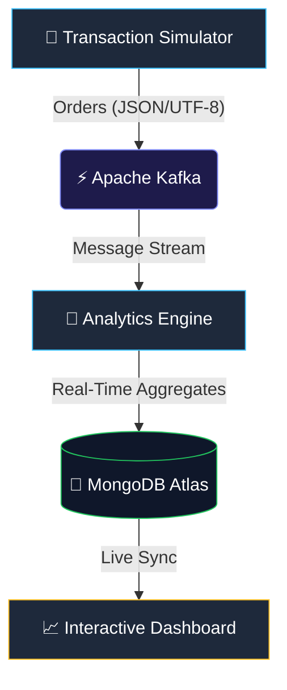

# 📊 Real-Time E-Commerce Analytics Pipeline

[](https://www.python.org/)
[](https://kafka.apache.org/)
[](https://www.mongodb.com/cloud/atlas)
[](https://streamlit.io/)
[](https://opensource.org/licenses/MIT)

A professional, end-to-end event-driven architecture designed to simulate, process, and visualize global e-commerce transaction streams in real-time. This project features a **Cloud-Native persistence layer** using MongoDB Atlas and is optimized for seamless deployment on Streamlit Cloud.

---

## 🏗️ Technical Architecture

The system follows a resilient streaming topology designed for high throughput and low-latency business intelligence:



### **Component Breakdown**
*   **Simulator (Producer)**: Generates high-fidelity mock transactions (Revenue, Categories, Payment methods) with built-in **Self-Healing retry logic**.
*   **Apache Kafka (Broker)**: Acts as the high-throughput event backbone using the `orders` topic.
*   **Analytics Engine (Consumer)**: A robust processor with advanced error handling that performs live state-aggregation and persists snapshots directly to the cloud.
*   **Persistence Layer**: **MongoDB Atlas Cloud Integration** for secure, location-independent data storage.
*   **BI Dashboard**: A high-performance Streamlit UI optimized for **Streamlit Cloud Deployment**.

---

## ✨ Features & Resilience

### 🛡️ **Self-Healing Connectivity**
Built for the real world, both the producer and consumer feature an **exponential backoff retry mechanism**, ensuring they can wait for infrastructure to stabilize or recover from transient disconnects without data loss.

### 🍱 **Cloud-Ready Persistence**
By utilizing MongoDB Atlas, this project eliminates local database dependencies. This allows for a **Hybrid Deployment Pattern**: run the analytics engine anywhere, and view the results on a globally accessible dashboard.

### 📊 **Live Business Intelligence**
-   **Dynamic Revenues**: Real-time tracking of total sales and order volume.
-   **Trend Analysis**: Live up/down indicators tracking performance changes in seconds.
-   **Category Distribution**: Real-time visualization of market share across product lines.

---

## 🚀 Getting Started

### Prerequisites
-   **Python 3.12+**
-   **Git**
-   **MongoDB Atlas Cluster** (A free M0 tier cluster is perfect)

### Installation
1.  **Clone the Repository**:
    ```bash
    git clone https://github.com/Veerendra20/Real-time-ecommerce-analytics-pipeline.git
    cd Real-time-ecommerce-analytics-pipeline
    ```
2.  **Install Dependencies**:
    ```bash
    py -3.12 -m pip install -r requirements.txt
    ```

### Configuration
Update the `.env` file with your **MongoDB Atlas connection string**:
```bash
MONGO_URI=mongodb+srv://<user>:<password>@cluster0.mongodb.net/?appName=Cluster0
```

---

## 🛠️ Usage

### **Power Launch (Automated)**
Launch the entire local stack with a single managed script. This orchestrates Zookeeper, Kafka, the Simulator, and the Analytics Engine sequentially.

> [!IMPORTANT]
> **Cloud Setup**: For **Streamlit Cloud** deployment, ensure you add your Atlas URI to the **Secrets** menu in the Streamlit dashboard as `mongo.connection_string`.

```powershell
powershell -ExecutionPolicy Bypass -File run_pipeline.ps1
```

### **Manual Data Verification**
Run the diagnostic tool to monitor the live Atlas database state independently:
```bash
py -3.12 verify_flow.py
```

---

## 📊 Analytics KPI Mapping
The pipeline tracks critical e-commerce metrics in real-time:
| Metric | Technical Logic | Business Insight |
| :--- | :--- | :--- |
| **Total Revenue** | `sum(transaction_amount)` | Gross Merchandise Value (GMV) |
| **Order Volume** | `count(order_id)` | Operational throughput |
| **AOV** | `revenue / orders` | Customer purchasing power |
| **Popularity** | `group_by(category).count` | Inventory focus & demand |

---

## 🛡️ License
This project is licensed under the MIT License - see the [LICENSE](LICENSE) file for details. Built for educational and professional demonstration purposes. 🚀
