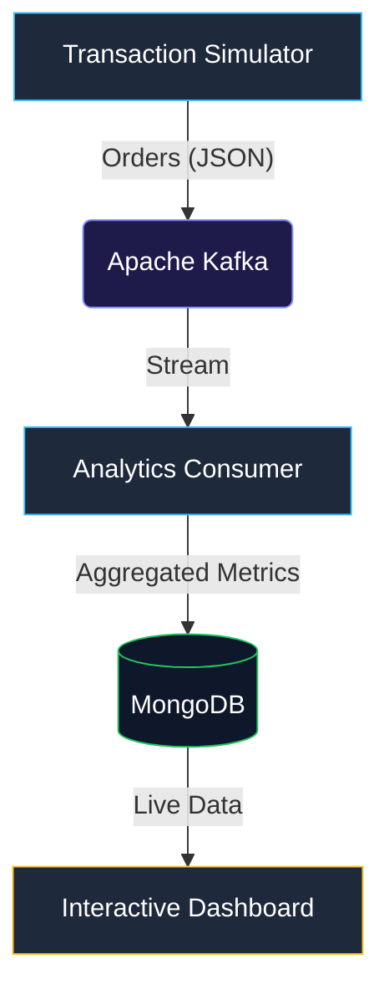

# 📊 Real-Time E-Commerce Analytics Pipeline

A state-of-the-art, end-to-end data pipeline designed to simulate, process, and visualize global e-commerce transactions in real-time. Built with a robust event-driven architecture using Kafka, MongoDB, and a modern interactive dashboard.

---

## 🏗️ Architecture Overview

The system follows a modern streaming architecture optimized for stability and resilience:



1.  **Transaction Simulator (Producer)**: A Python-based agent with **self-healing retry logic** that generates high-fidelity mock e-commerce transactions and streams them into Kafka.
2.  **Apache Kafka (Broker)**: Acts as the message backbone, ensuring horizontally scalable event ingestion on the `orders` topic.
3.  **Analytics Consumer (Processor)**: A high-performance engine with **self-healing retry logic** that performs real-time aggregations and persists the world-state to MongoDB.
4.  **MongoDB (State Store)**: Supports both **Local Host** and **MongoDB Atlas Cloud** configurations for flexible data persistence.
5.  **Interactive Dashboard (Visualization)**: A modern interactive Streamlit interface providing real-time business intelligence with low-latency updates.

---

## ✨ Features & Stabilization

-   **High Availability**: Synchronized startup sequence with built-in delays ensures Kafka and Zookeeper are fully stable before consumers connect.
-   **Terminal Resilience**: Optimized logging (no-emoji fallback) prevents crashes in legacy Windows terminal environments (CP1252).
-   **Dual-Database Support**: Seamlessly switch between Local and Cloud storage via environment variables.
-   **Diagnostic Tooling**: Integrated verification scripts to monitor data flow across the entire pipeline.

---

## 🚀 Getting Started

### Prerequisites

-   **Python 3.12+**
-   **Java 11+** (bundled in `/j/` directory for portable use)
-   **Local MongoDB** (optional, running on `localhost:27017`)

### Environment Configuration

Configure your storage backend in the `.env` file:

```bash
# For Local Host MongoDB:
MONGO_URI=mongodb://localhost:27017/

# For MongoDB Atlas Cloud:
# MONGO_URI=mongodb+srv://<user>:<password>@cluster.mongodb.net/
```

### Installation

1.  **Install Python Dependencies**:
    ```bash
    py -3.12 -m pip install -r requirements.txt
    ```

---

## 🛠️ Usage

### Power Launch (Automated)

The entire pipeline can be started with a single command. This script orchestrates Zookeeper, Kafka, the Simulator, the Consumer, and the Dashboard.

> [!IMPORTANT]
> **Middleware Dependency**: To keep this repository lightweight, the `j/` (Java) and `k/` (Kafka) folders have been excluded. Ensure you have these directories in the root before running the power launch script.

```powershell
powershell.exe -ExecutionPolicy Bypass -File run_pipeline.ps1
```

### Manual Verification
If you suspect a data flow issue, run the diagnostic tool:
```bash
py -3.12 verify_flow.py
```

---

## 📊 Analytics Schema

The engine tracks the following global metrics:
-   `total_revenue`: Aggregate successful transaction value (INR).
-   `total_orders`: Count of successful transaction events.
-   `avg_order_value`: Dynamic calculation of average transaction size.
-   `product_counts`: Distribution of sales across major product lines.
-   `recent_transactions`: Real-time history log of the last 10 events.

---

## 🛡️ License
This project is for educational and portfolio demonstration purposes. 🚀
